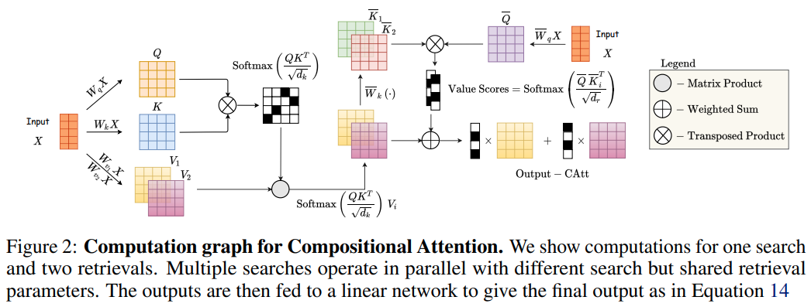

</img>

## Compositional Attention - Pytorch (wip)

Implementation of <a href="https://arxiv.org/abs/2110.09419">Compositional Attention</a> from MILA. They reframe the "heads" of multi-head attention as "searches", and once the multi-headed/searched values are aggregated, there is an extra retrieval step off the searched results. They then show this variant of attention yield better OOD results on a toy task. Their ESBN results still leaves a lot to be desired, but I like the general direction of the paper.

## Citations

```bibtex
@article{Mittal2021CompositionalAD,
    title   = {Compositional Attention: Disentangling Search and Retrieval},
    author  = {Sarthak Mittal and Sharath Chandra Raparthy and Irina Rish and Yoshua Bengio and Guillaume Lajoie},
    journal = {ArXiv},
    year    = {2021},
    volume  = {abs/2110.09419}
}
```
